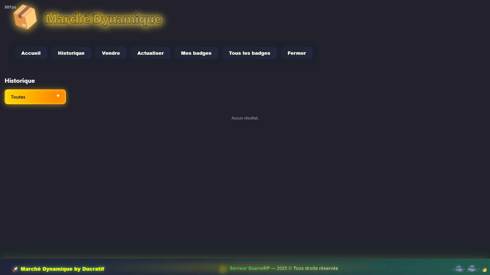
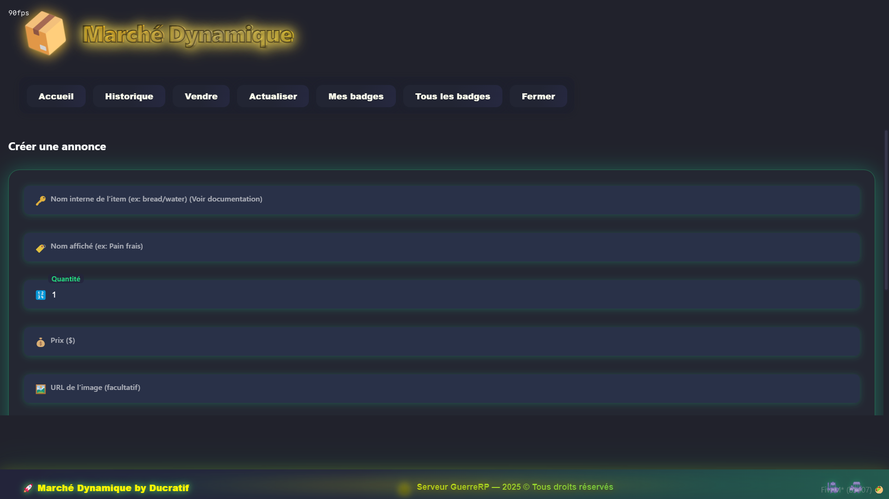
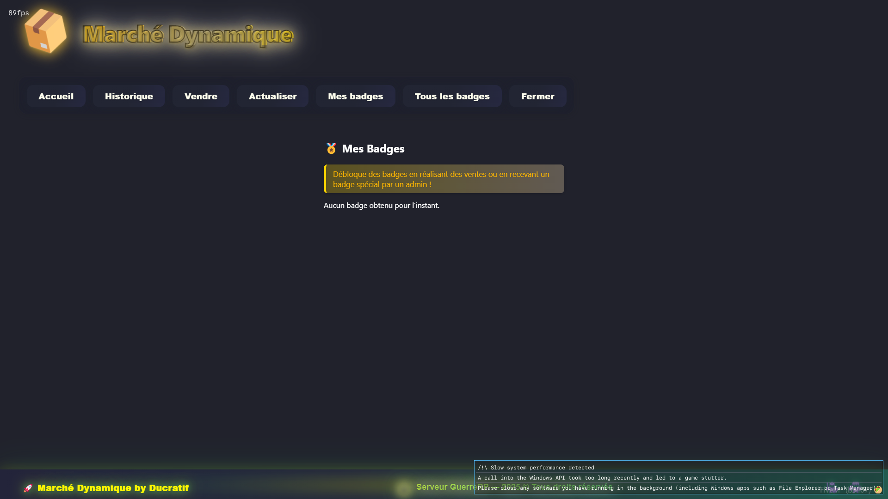
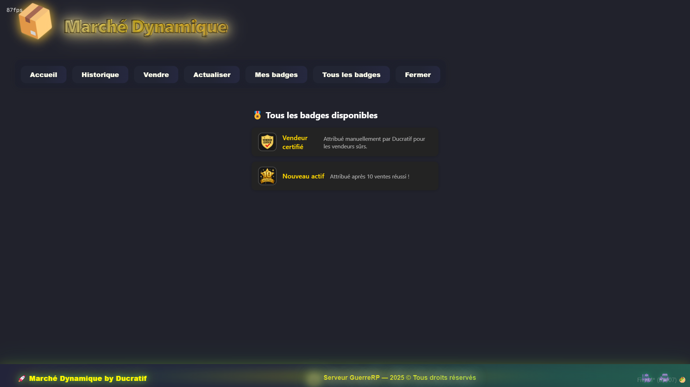

# 🧺 Marché Dynamique – Boutique LBC (FiveM)

> Marketplace entre joueurs inspiré de **Leboncoin**, avec interface NUI moderne, historique détaillé, badges, hors‑ligne support et intégration complète ESX/ox_inventory.

**Ressource** : `boutique_lbc`  
**Auteur** : Ducratif  
**Framework** : ESX Legacy + ox_inventory + ox_lib + oxmysql  

---

## 🧭 Sommaire

- [✨ Présentation](#-présentation)
- [🖼️ Preview / Screenshots](#️-preview--screenshots)
- [📁 Structure du script](#-structure-du-script)
- [✅ Pré-requis](#-pré-requis)
- [⚙️ Installation](#️-installation)
- [🔧 Configuration](#-configuration)
  - [Touche & commande](#touche--commande)
  - [Taxe de mise en vente](#taxe-de-mise-en-vente)
  - [Monnaie utilisée](#monnaie-utilisée)
  - [Badges](#badges)
- [🎮 Utilisation en jeu](#-utilisation-en-jeu)
  - [Ouverture du marché](#ouverture-du-marché)
  - [Onglet Accueil](#onglet-accueil)
  - [Onglet Historique](#onglet-historique)
  - [Onglet Vendre](#onglet-vendre)
  - [Achat dune annonce](#achat-dune-annonce)
  - [Suppression dannonce](#suppression-dannonce)
- [🧑‍💻 API & Events développeurs](#-api--events-développeurs)
- [🎨 Personnalisation UI](#-personnalisation-ui)
- [📜 Crédit & conditions](#-crédit--conditions)

---

## ✨ Présentation

**Boutique LBC** est un script FiveM permettant de mettre en place un **vrai marché entre joueurs**, façon site de petites annonces :

- 🛒 Création d’annonces par les joueurs (prix libre, quantité, image custom)
- 💰 Taxe de mise en vente configurable (sink économique)
- 🔁 Ventes gérées en **ligne et hors‑ligne**
- 📜 Historique complet (ventes, achats, annonces)
- 🏅 Système de **badges** (gros vendeur, 10 ventes, certifié, etc.)
- 🧾 Interface NUI moderne, claire et responsive
- 🔐 Vérifications côté serveur & intégration **ox_inventory**

L’objectif : remplacer les /give entre potes par un **vrai marché roleplay**, traçable et configurable, tout en restant simple à utiliser pour les joueurs.

---

## 🖼️ Preview / Screenshots


### 🏠 Accueil – Liste des annonces


- Affichage des annonces actives
- Image, nom d’item, prix, quantité
- Badges visibles sur les vendeurs (gros vendeur, certifié…)

---

### 🧾 Historique & détails des transactions



- Ventes, achats, annonces actives
- Filtres directement dans l’UI
- Logs propres côté base de données

---

### 📤 Création d’annonce



- Formulaire complet
- Prix, quantité, image, description
- Vérification serveur avant validation

---

### 🏅 Badges & profil vendeur





- Liste des badges débloqués
- Affichage de tous les badges possibles
- Idéal pour gamifier le marché

---

## 📁 Structure du script

```text
boutique_lbc/
├── fxmanifest.lua
├── client.lua
├── server.lua
├── lbc.sql
└── html/
    ├── index.html
    ├── style.css
    ├── script.js
    └── assets/
        ├── default.png
        ├── badge_10sale.png
        └── badge_certifie.png
```

---

## ✅ Pré-requis

Script prévu pour une stack moderne :

- `es_extended` (ESX Legacy)
- `ox_lib`
- `oxmysql`
- `ox_inventory`
- Base MySQL fonctionnelle
- Un item **`money`** dans ox_inventory (monnaie physique)

> Si vous utilisez seulement les comptes ESX (`bank`, `money`, etc.), il faudra adapter la partie **AddItem/RemoveItem** dans `server.lua`.

---

## ⚙️ Installation

### 1️⃣ Copier la ressource

Place le dossier dans tes ressources, par exemple :

```text
resources/[scripts]/boutique_lbc
```

### 2️⃣ Importer la base de données

Dans ton client MySQL (HeidiSQL, phpMyAdmin, CLI…) :

```sql
SOURCE /chemin/vers/boutique_lbc/lbc.sql;
```

Ce fichier crée les tables :

- `lbc_annonces`
- `lbc_historique`
- `lbc_badges`
- `lbc_user_badges`

Et les champs nécessaires (ex : `pending_money` pour gérer l’argent hors‑ligne).

### 3️⃣ Ajouter dans `server.cfg`

```cfg
ensure oxmysql
ensure ox_lib
ensure es_extended
ensure ox_inventory

ensure boutique_lbc
```

### 4️⃣ Redémarrer le serveur

```cfg
restart boutique_lbc
```

---

## 🔧 Configuration

### Touche & commande

Dans `client.lua` tu trouveras un mapping du style :

```lua
RegisterKeyMapping('openlbc', 'Marché Dynamique (LBC)', 'keyboard', 'F3')

RegisterCommand('openlbc', function()
    SetNuiFocus(true, true)
    SendNUIMessage({ action = 'openMarket' })
end, false)
```

- Touche par défaut : **F3**
- Commande : `/openlbc`

Tu peux changer `'F3'` par la touche que tu veux, ou adapter le nom de la commande.

---

### Taxe de mise en vente

Dans `server.lua`, au moment de la création d’annonce :

```lua
local hasMoney = exports.ox_inventory:Search(src, 'count', 'money')
if not hasMoney or hasMoney < 1000 then 
    TriggerClientEvent('market:createAnnonceResult', src, {success = false, message = "Pas assez d'argent"})
    return
end

exports.ox_inventory:RemoveItem(src, 'money', 1000)
```

- `1000` = montant de la **taxe de publication** d’une annonce.
- Modifie cette valeur selon ton économie.
- Tu peux retirer la taxe (non recommandé sur un gros serveur public).

---

### Monnaie utilisée

Par défaut, tout passe par l’item `money` d’ox_inventory :

- Débit lors de la création d’annonce (taxe)
- Débit à l’achat
- Crédit au vendeur (en ligne ou hors‑ligne)

Si tu utilises un autre item (ex : `cash`), remplace simplement `'money'` par ton item dans les fonctions concernées de `server.lua`.

---

### Badges

Les badges sont définis dans `lbc_badges` :

```sql
CREATE TABLE IF NOT EXISTS lbc_badges (
    id INT AUTO_INCREMENT PRIMARY KEY,
    code VARCHAR(32) NOT NULL UNIQUE,
    name VARCHAR(64) NOT NULL,
    description VARCHAR(255) DEFAULT NULL,
    image_url VARCHAR(255) DEFAULT NULL
);
```

Exemple d’ajout :

```sql
INSERT INTO lbc_badges (code, name, description, image_url)
VALUES ('certifie', 'Vendeur certifié', 'Vendeur de confiance', 'html/assets/badge_certifie.png');
```

Et pour attribuer un badge à un joueur :

```sql
INSERT INTO lbc_user_badges (identifier, badge_code)
VALUES ('steam:11000011abcdefg', 'certifie');
```

Le script gère déjà automatiquement un badge de type **“10 ventes”** (à partir d’un certain nombre de ventes).

---

## 🎮 Utilisation en jeu

### Ouverture du marché

- Presser **F3** (par défaut)
- Ou utiliser `/openlbc`

La NUI se lance, la souris est capturée, le joueur navigue uniquement dans l’interface.

---

### Onglet Accueil

- Liste **toutes les annonces actives** (`status = 'en_vente'`)
- Affiche :
  - image de l’item
  - nom
  - quantité
  - prix
  - badges du vendeur
- Filtre possible pour n’afficher **que les annonces du joueur** (selon son identifier).

Un clic sur une annonce ouvre une popup de **confirmation d’achat**.

---

### Onglet Historique

- Ventes
- Achats
- Annonces actives

Les données proviennent de `lbc_historique` et de `lbc_annonces`.  
L’interface permet de filtrer rapidement les différents types d’entrées.

---

### Onglet Vendre

Formulaire de création d’annonce avec :

- Nom interne de l’item (ex : `bread`, `water`)
- Nom affiché (label custom)
- Quantité
- Prix
- URL d’image (optionnel)
- Description

Côté serveur :

1. Vérification des champs
2. Vérification de la possession de l’item
3. Vérification de la taxe (argent)
4. Retrait des items + taxe
5. Insertion en base dans `lbc_annonces`

En cas d’erreur : message de retour propre dans l’UI.

---

### Achat d’une annonce

Quand un joueur clique sur **Acheter** :

1. Vérification que l’annonce existe encore et est en vente
2. Vérification qu’il n’achète pas **sa propre** annonce
3. Vérification des fonds (`money`)
4. Retrait de l’argent à l’acheteur
5. Ajout de l’item via ox_inventory
6. Passage de l’annonce à l’état `vendu`
7. Ajout d’une entrée dans `lbc_historique`
8. Crédit du vendeur :
   - s’il est en ligne → il reçoit immédiatement
   - s’il est hors‑ligne → la somme est stockée (ex : `pending_money`) et versée à sa prochaine connexion

---

### Suppression d’annonce

#### Par le joueur (vendeur)

Net event côté serveur, typiquement :

```lua
RegisterNetEvent('market:deleteAnnonce', function(annonceId)
    -- vérifie que l’annonce appartient au joueur
    -- statue = "supprimee"
    -- restitution des items si nécessaire
end)
```

#### Par un admin / staff

Callback dédié :

```lua
lib.callback.register('lbc:deleteAnnonce', function(source, data, cb)
    -- suppression avec logique staff custom
end)
```

Idéal à brancher sur un menu staff / admin.

---

## 🧑‍💻 API & Events développeurs

Quelques events & callbacks utiles :

### Events serveur

- `market:getAnnonces`  
  → renvoie les annonces au client (`market:returnAnnonces`)

- `market:getHistorique`  
  → renvoie l’historique (`market:returnHistorique`)

- `market:createAnnonce`  
  → création d’une annonce après toutes les vérifications

- `market:buyAnnonce`  
  → achat d’une annonce

- `market:deleteAnnonce`  
  → suppression par le vendeur

- `market:getUserBadges`, `market:getAllBadges`, `market:getBadgesForIdentifier`  
  → gestion des badges côté client/NUI

- `market:getPlayerIdentifier`  
  → renvoie l’identifier ESX du joueur

- `market:forceNuiOff`  
  → ferme la NUI côté client

### Callbacks ox_lib

- `lbc:getPlayerInventory`  
  → renvoie l’inventaire du joueur (pratique si tu veux afficher ses items dans la NUI)

- `lbc:deleteAnnonce`  
  → suppression d’annonce (version staff/admin)

---

## 🎨 Personnalisation UI

Tout ce qui touche à l’interface se trouve dans `html/` :

- `index.html` : structure de la page
- `style.css` : design, couleurs, animations
- `script.js` : logique NUI, réception des messages, appels vers le client

Tu peux :

- changer le **thème** (couleurs, polices, ombres, animations)
- mettre tes propres **images** dans `html/assets/`
- adapter les **textes** pour ton serveur (FR, EN, autre…)

---

## 📜 Crédit & conditions

Ce script fait partie de l’écosystème **GuerreRP** et est développé par **Ducratif**.

- ✅ Utilisation et modification **autorisées** sur vos serveurs
- ✅ Personnalisation visuelle & intégration à vos systèmes
- ❌ Revente ou redistribution payante non autorisée sans l’accord explicite de Ducratif
- 🙏 Merci de **conserver les crédits** présents dans les fichiers et dans ce README

---

> Pour toute question, bug ou amélioration : utilisez votre système de tickets Discord lié à la boutique, ou intégrez ce script dans votre propre écosystème Ducratif / GuerreRP.  
> Bon dev & bon roleplay 🧡
